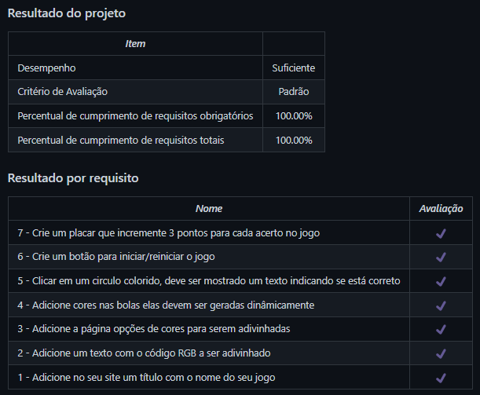

# Color Guess
Projeto da [Trybe](https://www.betrybe.com/) - Bloco 5 - Aplicação de adivinhação de cores feita com HTML, CSS e JavaScript.

## 💻 Projeto

Jogo de adivinhação de cores feito com HTML, CSS e JavaScript em que a pontuação é atualizada de acordo com os acertos. 

  
<strong>🏆 Meu desempenho</strong>
 

  

## 🚀 Tecnologias
> Este projeto foi desenvolvido com as seguintes tecnologias:

- HTML
- CSS
- JavaScript

## 📌 Habilidades
> Neste projeto, desenvolvi as seguintes habilidades:

- Manipular o DOM;
- Manipular o JavaScript.

## 💬 Contatos

   
   
  

<!-- ## 📄 Licença

Esse projeto está sob licença. Veja o arquivo [LICENÇA](LICENSE.md) para mais detalhes.

[⬆ Voltar ao topo](#nome-do-projeto)  -->
